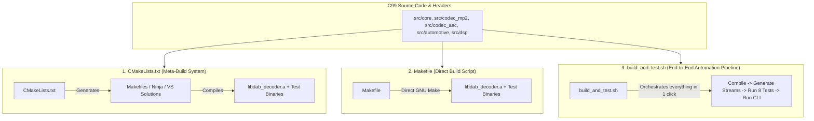

# Build Systems Guide
### Automotive DAB / DAB+ Audio Decoder (Milestones MS-1 to MS-4)

---

## 1. Overview & Conceptual Architecture

The codebase includes three distinct build mechanisms:
1. **`CMakeLists.txt`** — Industry-standard meta-build system for IDEs, cross-compilation, and enterprise CI/CD.
2. **`Makefile`** — Lightweight, standalone GNU Make script with zero external dependencies, ideal for embedded targets.
3. **`build_and_test.sh`** — One-click end-to-end automation shell script that builds the library, generates synthetic `.au` test streams, runs all 8 test suites, and executes the CLI harness.

All three systems operate on the **exact same ISO C99 source code and headers**, producing identical binary outputs (`libdab_decoder.a`, `dab_test_harness`, and test executables).



---

## 2. Detailed Breakdown of the Three Files

### A. `CMakeLists.txt` (Meta-Build System)
* **What it is:** A configuration file for **CMake**. CMake is *not* a compiler itself; it is a meta-build system that generates native build scripts (such as Makefiles, Ninja build scripts, Visual Studio solutions, or Xcode projects) tailored to the developer's specific platform or IDE.
* **Why it exists:** In automotive production teams, developers and integration engineers work across diverse environments (Windows, Linux, QNX, macOS, VS Code, CLion, Eclipse). `CMakeLists.txt` provides a single, portable source of truth that standardizes compiler flags, warnings, include directories, and target dependencies.
* **Primary Strengths:**
  - Standard integration with modern IDEs and continuous integration (CI) systems.
  - Robust cross-compilation support via toolchain files (e.g. `cmake/toolchain_odroid_n2.cmake`).
  - Native automated test discovery and execution via `ctest`.

### B. `Makefile` (Direct Embedded Build Script)
* **What it is:** A direct, low-level build script for **GNU Make**. It contains explicit dependency rules and shell commands specifying how to compile `.c` files into `.o` objects and archive them into `libdab_decoder.a`.
* **Why it exists:** On small embedded target platforms like the **Hardkernel Odroid N2+**, engineers often work directly over SSH on a headless Linux shell. Installing CMake or complex build environments is often unnecessary overhead. With `Makefile`, the developer simply types `make` to build the entire suite using the system's native `gcc`.
* **Primary Strengths:**
  - Zero dependencies beyond standard GNU Make and GCC.
  - Automatic target architecture detection via `$(CC) -dumpmachine`.
  - Simple, readable, and highly customizable from the command line (e.g. `make CC=aarch64-linux-gnu-gcc`).

### C. `build_and_test.sh` (Turn-Key Verification Pipeline)
* **What it is:** A Bash shell script that orchestrates the **entire lifecycle of the project from scratch in a single command**:
  1. Compiles all library object files with strict automotive compiler flags (`-std=c99 -Wall -Wextra -Wpedantic -Werror -O2 -fno-common`).
  2. Creates the static library `libdab_decoder.a`.
  3. Compiles the CLI test harness (`dab_test_harness`) and the synthetic stream generator (`generate_streams`).
  4. Generates all 6 reference `.au` bitstream test files programmatically.
  5. Compiles and executes all 8 unit test suites.
  6. Runs the CLI test harness on an error-injected scenario stream to verify decoding, RIFF WAV generation, and CSV telemetry logging.
* **Why it exists:** It serves as a **one-click verification harness** for quick local sanity checks on a developer laptop or automated nightly verification in CI runners.

---

## 3. Side-by-Side Comparison

| Feature / Dimension | `CMakeLists.txt` | `Makefile` | `build_and_test.sh` |
| :--- | :--- | :--- | :--- |
| **Tooling Required** | `cmake` + (Make / Ninja / MSVC) | `make` + `gcc` / `clang` | `bash` + `gcc` / `ar` |
| **Primary Purpose** | Enterprise IDE & CI/CD build configuration | Simple, zero-dependency embedded compiling | Complete turn-key compilation + test pipeline |
| **Compiles Code?** | Generates native build files to compile | Yes, directly | Yes, directly |
| **Automated Test Runner?** | Yes (via `ctest`) | Yes (via `make test`) | Yes (runs all 8 test executables automatically) |
| **Generates Test Streams?** | Compiles generator executable only | Compiles generator executable only | Generates all 6 `.au` test files automatically |
| **Cross-Compilation** | Via toolchain file (`cmake/toolchain_odroid_n2.cmake`) | Via command-line arguments (`make CC=...`) | Configurable via script environment variables |
| **CPU Architecture Detection**| Controlled via `-DDAB_ENABLE_NEON=ON/OFF` | Automatic via `$(CC) -dumpmachine` | Direct compiler invocation |

---

## 4. How They Behave Across Environments

The automotive decoder supports two operational modes:
1. **Pure C99 Scalar Mode:** Standard ISO C99 mathematics, bit-exact and 100% portable across any CPU (Intel/AMD laptop, x86_64, ARM, RISC-V).
2. **ARM64 NEON Vectorized Mode:** Hand-tuned vector kernels (`vqdmulhq_s16`, `vld1q_s16`, `vst1q_s16`) targeting the ARM Cortex-A73/A55 cores of the Odroid N2+.

The three files adapt to these environments as follows:

### 4.1 In `CMakeLists.txt`
* **On Laptop (x86_64 Windows / Linux / WSL):**
  - By default, `DAB_ENABLE_NEON` is set to `OFF`.
  - CMake compiles all modules in **Pure C99 Scalar Mode**, ensuring immediate, error-free execution on your laptop CPU.
* **For Odroid N2+ (Cross-Compiling from Laptop):**
  - Pass the toolchain file:
    ```bash
    mkdir build_arm64 && cd build_arm64
    cmake .. -DCMAKE_TOOLCHAIN_FILE=../cmake/toolchain_odroid_n2.cmake -DCMAKE_BUILD_TYPE=Release
    cmake --build .
    ```
  - CMake automatically sets the compiler to `aarch64-linux-gnu-gcc`, enables `-march=armv8-a+simd`, and activates `#define __ARM_NEON` and `#define __aarch64__`.

### 4.2 In `Makefile`
* **Automatic Target Detection:**
  The Makefile inspects the target triple of the compiler:
  ```makefile
  ARCH := $(shell $(CC) -dumpmachine 2>/dev/null)
  ifneq (,$(findstring aarch64,$(ARCH)))
      CFLAGS += -D__ARM_NEON -D__aarch64__ -march=armv8-a+simd
  endif
  ```
* **On Laptop:**
  `gcc -dumpmachine` reports `x86_64-...`. The Makefile recognizes an x86 host and compiles purely in **C99 Scalar Mode**.
* **On Odroid N2+ (Native on Board):**
  When executed directly on the Odroid board, `gcc -dumpmachine` reports `aarch64-linux-gnu`. The Makefile **automatically detects ARM64 and enables NEON SIMD optimizations** without requiring any manual flags!
* **Cross-Compiling from Laptop:**
  Override the compiler variables on the command line:
  ```bash
  make CC=aarch64-linux-gnu-gcc AR=aarch64-linux-gnu-ar all
  ```

### 4.3 In `build_and_test.sh`
* **On Laptop:**
  Uses the local MSYS2/Linux GCC environment to compile and execute the complete test pipeline natively.
* **On Odroid N2+:**
  Can be copied directly to the Odroid N2+ board and executed natively under Ubuntu/Debian for an end-to-end sanity verification on physical hardware.

---

## 5. Step-by-Step Build Instructions

### 5.1 Using `run_pipeline.ps1` (1-Click Native Windows Pipeline)
* **From Windows PowerShell (in repository root):**
  ```powershell
  .\run_pipeline.ps1
  ```
  * Automatically sets up MSYS2 UCRT64 toolchain and CMake.
  * Compiles `build\libdab_decoder.a`, `build\automotive_decoder_runner.exe`, and `build\dab_test_harness.exe`.
  * Automatically decodes the stream asset to `build\decoded_output.wav`.

### 5.2 Using `build_and_test.sh` (Linux / WSL / MSYS2 Turn-Key Script)
* **From Windows PowerShell (using MSYS2):**
  ```powershell
  C:\msys64\usr\bin\bash.exe -c "./build_and_test.sh"
  ```
* **From MSYS2 / Git Bash / Linux / WSL Terminal:**
  ```bash
  chmod +x build_and_test.sh
  ./build_and_test.sh
  ```

### 5.3 Using `Makefile`
* **On Host (in repository root):**
  ```bash
  make clean
  make all
  ```
* **On Odroid N2+ (Native on Board):**
  ```bash
  ssh odroid@<ODROID_IP>
  cd /home/odroid/dab_automotive_decoder
  make clean && make all
  ```

### 5.4 Using `CMakeLists.txt`
* **On Host (in repository root):**
  ```bash
  cmake -B build -DCMAKE_BUILD_TYPE=Release
  cmake --build build
  ```
* **Cross-Compiling for Odroid N2+:**
  ```bash
  mkdir build_arm64 && cd build_arm64
  cmake .. -DCMAKE_TOOLCHAIN_FILE=../cmake/toolchain_odroid_n2.cmake -DCMAKE_BUILD_TYPE=Release
  cmake --build .
  ```

---

## 6. Recommended Workflow Guidelines

* **For Everyday Development & Quick Sanity on Laptop:**  
  Run `build_and_test.sh`. It ensures that changes compile without warnings (`-Werror`) and validates all 8 test suites and 10,000 soak frames in seconds.
* **For Odroid N2+ Hardware Test Team:**  
  Provide the `Makefile`. The test team can SSH into the board, run `make clean && make all && make test`, and immediately begin hardware validation.
* **For Enterprise Production & Automotive CI Integration:**  
  Use `CMakeLists.txt`. It integrates cleanly with Yocto recipes, Jenkins build nodes, and IDE toolchains.
