# Architecture & Component Inventory: `libdab_decoder.a`
### Automotive DAB / DAB+ Audio Decoder (Milestones MS-1 to MS-4)

---

## 1. Overview & Architectural Role

`libdab_decoder.a` is the unified static library containing the complete production-grade automotive audio decoding engine. It satisfies all functional, safety, and performance requirements for **Milestones MS-1 through MS-4**:

* **MS-1:** Public Host API, static memory management, and parameter configuration.
* **MS-2:** Audio codec cores for **DAB Classic** (MPEG-1/2 Audio Layer II MUSICAM) and **DAB+** (HE-AAC v2 with mandatory 960-sample window, SBR, and Parametric Stereo).
* **MS-2 Neon Optimization:** ARM64 NEON vector optimizations targeting Odroid N2+ (Cortex-A73/A55) with pure C99 fallback.
* **MS-3:** Automotive error mitigation (ETSI CRC-16/CCITT checking, 4-stage Concealment FSM, Soft Mute gain ramping, and Raised-Cosine Pop Prevention).
* **MS-4:** Telemetry & Seamless Blending (Asymmetric Audio Quality Index with Fast-Drop / Slow-Rise and 2-bit Hardware Blending Triggers).

### Key Architectural Invariants:
1. **Zero Dynamic Allocation (MISRA-C:2012 Rule 21.3):** 0 calls to `malloc`, `calloc`, `free`, or `realloc`. Memory is allocated statically by the caller.
2. **Zero Mutable Global State:** 0 mutable global variables (`.bss` = 0 bytes, `.data` = 0 bytes). 100% thread-safe and re-entrant for multi-tuner concurrency.
3. **Option A Clean IP:** 100% cleanroom proprietary C99 codebase from ISO/ETSI specifications with zero copyleft (no FFmpeg, libmad, libfdk-aac, FAAD2).

---

## 2. Architectural Layers

```mermaid
flowchart TD
    subgraph L1["1. Public API Layer"]
        API["include/dab_decoder.h"]
    end

    subgraph L2["2. Core Orchestration & Bitstream Layer"]
        INST["src/core/dab_instance.c / dab_internal.h"]
        BS["src/core/bitstream_reader.c / bitstream_reader.h"]
    end

    subgraph L3["3. DSP Math & Hardware Acceleration Layer"]
        DSP["src/dsp/dsp_math.c / dsp_math.h"]
        NEON["src/dsp/dsp_neon.c / dsp_neon.h"]
    end

    subgraph L4["4. Automotive Protection Layer (MS-3 & MS-4)"]
        CRC["src/automotive/dab_crc.c / dab_crc.h"]
        MUTE["src/automotive/soft_mute.c / soft_mute.h"]
        CONC["src/automotive/concealment.c / concealment.h"]
        POP["src/automotive/pop_prevention.c / pop_prevention.h"]
        AQI["src/automotive/aqi_engine.c / aqi_engine.h"]
    end

    subgraph L5["5. DAB Classic Codec Layer (MS-2a)"]
        MP2_DEC["src/codec_mp2/mp2_decoder.c / mp2_decoder.h"]
        MP2_SYN["src/codec_mp2/mp2_synth.c / mp2_synth.h"]
        MP2_TAB["src/codec_mp2/mp2_tables.c / mp2_tables.h"]
    end

    subgraph L6["6. DAB+ Digital Radio Codec Layer (MS-2b, 2c, 2d)"]
        AAC_DEC["src/codec_aac/aac_decoder.c / aac_decoder.h"]
        AAC_HUF["src/codec_aac/aac_huffman.c / aac_huffman.h"]
        AAC_IMD["src/codec_aac/aac_imdct.c / aac_imdct.h"]
        AAC_SBR["src/codec_aac/aac_sbr.c / aac_sbr.h"]
        AAC_PS["src/codec_aac/aac_ps.c / aac_ps.h"]
        AAC_TAB["src/codec_aac/aac_tables.c / aac_tables.h"]
    end

    API --> INST
    INST --> BS
    INST --> CRC
    INST --> MP2_DEC
    INST --> AAC_DEC
    INST --> CONC
    INST --> POP
    INST --> MUTE
    INST --> AQI

    MP2_DEC --> MP2_SYN
    MP2_DEC --> MP2_TAB
    MP2_DEC --> DSP
    MP2_SYN --> NEON

    AAC_DEC --> AAC_HUF
    AAC_DEC --> AAC_IMD
    AAC_DEC --> AAC_SBR
    AAC_DEC --> AAC_PS
    AAC_DEC --> AAC_TAB
    AAC_IMD --> DSP
    AAC_SBR --> NEON
```



---

## 3. Source & Header Files Contributing to `libdab_decoder.a`

The static library archive is built from **18 C source files (`.c`)** and their accompanying internal/public header files (`.h`):

```text
libdab_decoder.a
│
├── [Public API Layer]
│   └── include/dab_decoder.h             # Master frozen public C API (MS-1)
│
├── [Core Architecture Layer]
│   ├── src/core/dab_instance.c           # Pipeline coordinator (CRC -> Codec -> Conceal -> Mute -> AQI)
│   ├── src/core/dab_internal.h           # Opaque instance context & state definitions
│   ├── src/core/bitstream_reader.c       # Safe bounds-checked bitstream parser
│   └── src/core/bitstream_reader.h
│
├── [DSP Math & Vector Acceleration Layer]
│   ├── src/dsp/dsp_math.c                # Q15 fixed-point math, 128-entry Cosine LUT, vector kernels
│   ├── src/dsp/dsp_math.h
│   ├── src/dsp/dsp_neon.c                # ARM64 NEON vectorized kernels for Odroid N2+
│   └── src/dsp/dsp_neon.h
│
├── [Automotive Error Mitigation Layer] (MS-3 & MS-4)
│   ├── src/automotive/dab_crc.c          # ETSI EN 300 401 §12.2 CRC-16/CCITT calculation
│   ├── src/automotive/dab_crc.h
│   ├── src/automotive/soft_mute.c        # Gain ramp engine (Linear, Cosine LUT, Exponential)
│   ├── src/automotive/soft_mute.h
│   ├── src/automotive/concealment.c      # 4-stage FSM (NONE -> INTERPOLATE -> ATTENUATE -> MUTED)
│   ├── src/automotive/concealment.h
│   ├── src/automotive/pop_prevention.c   # Raised-cosine crossfade preventing speaker clicks
│   ├── src/automotive/pop_prevention.h
│   ├── src/automotive/aqi_engine.c       # Fast-Drop / Slow-Rise AQI & 2-bit Blending Triggers
│   └── src/automotive/aqi_engine.h
│
├── [DAB Classic Codec Layer] (MS-2a)
│   ├── src/codec_mp2/mp2_tables.c        # ISO 11172-3 scale factors & bit allocation tables
│   ├── src/codec_mp2/mp2_tables.h
│   ├── src/codec_mp2/mp2_synth.c         # 32-subband polyphase matrixing & 512-coeff window
│   ├── src/codec_mp2/mp2_synth.h
│   ├── src/codec_mp2/mp2_decoder.c       # MUSICAM decoder (Stereo/Joint/Dual/Mono/LSF)
│   └── src/codec_mp2/mp2_decoder.h
│
└── [DAB+ Digital Radio Codec Layer] (MS-2b, 2c, 2d)
    ├── src/codec_aac/aac_tables.c        # Huffman codebooks CB1-11, 960-sine window
    ├── src/codec_aac/aac_tables.h
    ├── src/codec_aac/aac_huffman.c       # Bounded escape sequence Huffman decoder
    ├── src/codec_aac/aac_huffman.h
    ├── src/codec_aac/aac_imdct.c         # Fast 960-point rotation recurrence IMDCT
    ├── src/codec_aac/aac_imdct.h
    ├── src/codec_aac/aac_sbr.c           # SBR 32-to-64 band QMF upsampling filterbank
    ├── src/codec_aac/aac_sbr.h
    ├── src/codec_aac/aac_ps.c            # Parametric Stereo all-pass decorrelator
    ├── src/codec_aac/aac_ps.h
    ├── src/codec_aac/aac_decoder.c       # DAB+ HE-AAC v2 core orchestrator
    └── src/codec_aac/aac_decoder.h
```

---

## 4. Component-by-Component Technical Specifications

### 4.1 Public API Layer
* **[`include/dab_decoder.h`](file:///C:/PersonalData/Shaan/Projects/dab_automotive_decoder/include/dab_decoder.h)**:
  * Master public interface exposed to the automotive host application.
  * Declares opaque handles (`DAB_Decoder_Handle`), handle sizing APIs (`DAB_Decoder_GetHandleSize`), static initialization (`DAB_Decoder_InitWithMem`), AU decoding (`DAB_Decoder_DecodeAU`), configuration setters, and telemetry querying functions.

### 4.2 Core Architecture Layer
* **[`src/core/dab_instance.c`](file:///C:/PersonalData/Shaan/Projects/dab_automotive_decoder/src/core/dab_instance.c)**:
  * Top-level orchestrator that sequences:
    1. Baseband AU CRC-16 check.
    2. Codec dispatch (MP2 or AAC core).
    3. Multi-stage concealment FSM processing.
    4. Pop-noise prevention crossfade.
    5. Soft mute gain ramp application.
    6. Asymmetric Audio Quality Index (AQI) & 2-bit blending trigger calculation.
    7. Telemetry reporting.
* **[`src/core/dab_internal.h`](file:///C:/PersonalData/Shaan/Projects/dab_automotive_decoder/src/core/dab_internal.h)**:
  * Defines `DAB_Instance_Context` struct.
  * Memory layout optimized: common automotive engines placed first (~15.5 KB), with codec union placed at the tail (MP2 context = 29.7 KB, safely within 32 KB; AAC context = 68.0 KB, safely within 96 KB).
* **[`src/core/bitstream_reader.c`](file:///C:/PersonalData/Shaan/Projects/dab_automotive_decoder/src/core/bitstream_reader.c) / `.h`**:
  * Safe, bounded bitstream reader with byte-level boundary enforcement, preventing buffer over-reads on truncated or corrupted radio packets.

### 4.3 DSP Math & Acceleration Layer
* **[`src/dsp/dsp_math.c`](file:///C:/PersonalData/Shaan/Projects/dab_automotive_decoder/src/dsp/dsp_math.c) / `.h`**:
  * ISO C99 fixed-point Q15 arithmetic, saturation clamping, polynomial trigonometric approximations (`dsp_sin_f32`, `dsp_cos_f32`), 128-entry Q15 cosine LUT, and scalar vector primitives (`copy`, `zero`, `scale`, `ramp`).
* **[`src/dsp/dsp_neon.c`](file:///C:/PersonalData/Shaan/Projects/dab_automotive_decoder/src/dsp/dsp_neon.c) / `.h`**:
  * Hand-tuned ARM64 NEON vector assembly/intrinsics (`vqdmulhq_s16`, `vld1q_s16`, `vst1q_s16`).
  * Guarded by `#if defined(__ARM_NEON) && defined(__aarch64__)` with automatic fallback to pure C99 on x86 platforms.

### 4.4 Automotive Error Mitigation Layer (MS-3 & MS-4)
* **[`src/automotive/dab_crc.c`](file:///C:/PersonalData/Shaan/Projects/dab_automotive_decoder/src/automotive/dab_crc.c) / `.h`**:
  * ETSI EN 300 401 §12.2 CRC-16/CCITT ($x^{16} + x^{12} + x^5 + 1$, poly `0x1021`, init `0xFFFF`).
* **[`src/automotive/soft_mute.c`](file:///C:/PersonalData/Shaan/Projects/dab_automotive_decoder/src/automotive/soft_mute.c) / `.h`**:
  * Automotive gain ramping with configurable attack (5–100 ms) and release (10–500 ms) across Linear, 128-entry Cosine LUT, and Exponential curve profiles.
* **[`src/automotive/concealment.c`](file:///C:/PersonalData/Shaan/Projects/dab_automotive_decoder/src/automotive/concealment.c) / `.h`**:
  * Multi-stage FSM:
    * Consecutive loss $\le 2$: `DAB_CONCEAL_INTERPOLATE` (linear spectral fade).
    * Consecutive loss 3 to 6: `DAB_CONCEAL_ATTENUATE` (attenuation step $0.9\times$/frame).
    * Consecutive loss $> 6$: `DAB_CONCEAL_MUTED` (digital silence).
* **[`src/automotive/pop_prevention.c`](file:///C:/PersonalData/Shaan/Projects/dab_automotive_decoder/src/automotive/pop_prevention.c) / `.h`**:
  * Raised-cosine crossfade on signal resumption, eliminating pop/click transients ($|\Delta S| \le 120$).
* **[`src/automotive/aqi_engine.c`](file:///C:/PersonalData/Shaan/Projects/dab_automotive_decoder/src/automotive/aqi_engine.c) / `.h`**:
  * Asymmetric Audio Quality Index (0..100) with Fast-Drop (drops to 0 on 1 error) and Slow-Rise (increments by +2/frame).
  * 2-bit blending hardware triggers (`0b00` IDLE, `0b01` CONCEAL, `0b10` UNRECOVERABLE).

### 4.5 DAB Classic Codec Layer (MS-2a)
* **[`src/codec_mp2/mp2_tables.c`](file:///C:/PersonalData/Shaan/Projects/dab_automotive_decoder/src/codec_mp2/mp2_tables.c) / `.h`**:
  * ISO/IEC 11172-3 normative scale factor tables, bit allocation tables for 48 kHz and 24 kHz, and C/D dequantization multipliers.
* **[`src/codec_mp2/mp2_synth.c`](file:///C:/PersonalData/Shaan/Projects/dab_automotive_decoder/src/codec_mp2/mp2_synth.c) / `.h`**:
  * 32-subband polyphase matrixing and 512-point synthesis window overlap-add filterbank.
* **[`src/codec_mp2/mp2_decoder.c`](file:///C:/PersonalData/Shaan/Projects/dab_automotive_decoder/src/codec_mp2/mp2_decoder.c) / `.h`**:
  * MUSICAM decoder supporting Stereo, Joint Stereo (`jsbound` 4, 8, 12, 16), Dual Channel, Mono, 48 kHz (1152 samples/AU), and 24 kHz MPEG-2 LSF (576 samples/AU).

### 4.6 DAB+ Digital Radio Codec Layer (MS-2b, 2c, 2d)
* **[`src/codec_aac/aac_tables.c`](file:///C:/PersonalData/Shaan/Projects/dab_automotive_decoder/src/codec_aac/aac_tables.c) / `.h`**:
  * Huffman codebooks CB1 through CB11, scale factor codebook, 960-point sine window, and SBR prototype filter coefficients.
* **[`src/codec_aac/aac_huffman.c`](file:///C:/PersonalData/Shaan/Projects/dab_automotive_decoder/src/codec_aac/aac_huffman.c) / `.h`**:
  * Bounded escape sequence Huffman decoder ($N \le 20$ iterations) preventing worst-case execution time runaway.
* **[`src/codec_aac/aac_imdct.c`](file:///C:/PersonalData/Shaan/Projects/dab_automotive_decoder/src/codec_aac/aac_imdct.c) / `.h`**:
  * Fast 960-point IMDCT using Goertzel recursive rotation recurrence (<0.18 ms/AU execution latency).
* **[`src/codec_aac/aac_sbr.c`](file:///C:/PersonalData/Shaan/Projects/dab_automotive_decoder/src/codec_aac/aac_sbr.c) / `.h`**:
  * Spectral Band Replication: 32-band analysis QMF, HF reconstruction, and 64-band synthesis QMF (2x upsampling to 48 kHz).
* **[`src/codec_aac/aac_ps.c`](file:///C:/PersonalData/Shaan/Projects/dab_automotive_decoder/src/codec_aac/aac_ps.c) / `.h`**:
  * Parametric Stereo: all-pass decorrelation filterbank and inter-channel spatial intensity/phase synthesis.
* **[`src/codec_aac/aac_decoder.c`](file:///C:/PersonalData/Shaan/Projects/dab_automotive_decoder/src/codec_aac/aac_decoder.c) / `.h`**:
  * DAB+ ETSI TS 102 563 superframe and pure AU parser, M/S stereo decoding, and core-to-SBR orchestration.

---

## 5. Library Properties & Verification Summary

| Metric | Verification Result | Automotive Compliance |
| :--- | :---: | :---: |
| **Contributing Source Files** | 18 `.c` files | Clean modular separation |
| **Dynamic Memory (`malloc`/`free`)** | **0 calls** | MISRA-C:2012 Rule 21.3 |
| **Static Mutable Globals (`.bss`/`.data`)** | **0 bytes** | Thread-Safe & Re-entrant |
| **MP2 Context Memory Footprint** | 29.7 KB (Alloc: 32 KB) | Static allocation verified |
| **AAC Context Memory Footprint** | 68.0 KB (Alloc: 96 KB) | Static allocation verified |
| **Compiler Cleanliness** | 0 warnings (`-Werror`) | ISO C99 / MISRA compliant |
| **Standards Compliance** | ETSI EN 300 401, ETSI TS 102 563, ISO 11172-3, ISO 14496-3 | Bit-exact normative verification |

---

## 6. How Host Applications Link Against `libdab_decoder.a`

When compiling the final automotive host application (or test harness), link against `libdab_decoder.a`:

```bash
# When built with CMake / run_pipeline.ps1 (library is in build/):
gcc main.c -Iinclude -Lbuild -ldab_decoder -o automotive_radio_app

# When built directly in repository root via Makefile:
gcc main.c -Iinclude -L. -ldab_decoder -o automotive_radio_app

# Using CMake:
target_link_libraries(automotive_radio_app PRIVATE dab_decoder)
```
