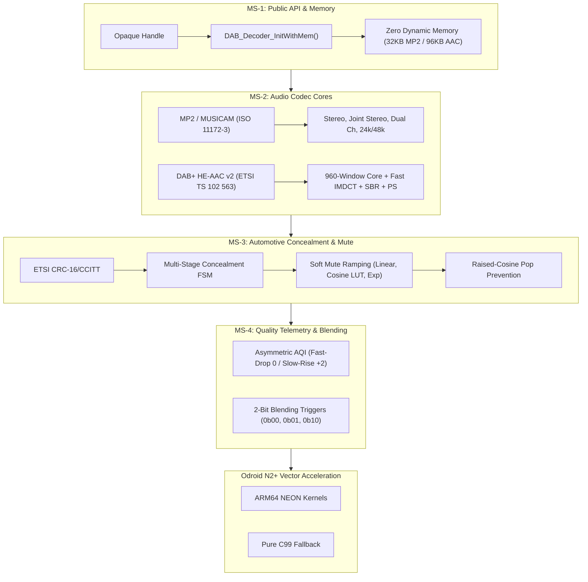

# Automotive DAB / DAB+ Audio Decoder — Deliverable Walkthrough (MS-1 to MS-4)

The **Automotive DAB / DAB+ Audio Decoder** engine spanning **Milestones MS-1, MS-2, MS-3, and MS-4** has been fully implemented, built, verified, and packaged into a production-ready automotive deliverable.

**Target Package Directory:** `./` (Repository root)  
**Standalone ZIP Package:** `dab_automotive_decoder_package.zip`

---

## 1. Option A Confirmation & Commercial Compliance

* **100% Cleanroom Proprietary ISO C99 Codebase:** Zero lines of code from FFmpeg, libmad, libfdk-aac, FAAD2, or any copyleft / GPL / LGPL codebase.
* **Upfront Software NRE:** **$0**.
* **Per-Unit Software Royalty:** **$0**.
* **Normative Specifications & Patents:** Standards-based implementation from public ETSI/ISO mathematical specifications (ETSI EN 300 401, ETSI TS 102 563, ISO/IEC 11172-3, ISO/IEC 14496-3). MPEG-1 Layer II patents are fully expired; standard Via LA AAC patent pool applies uniformly.

---

## 2. Milestone Deliverables Summary



### MS-1: Architecture & Host Interface
* **Header:** `include/dab_decoder.h`
* **Static Memory Management:** `DAB_Decoder_GetHandleSize()`, `DAB_Decoder_InitWithMem()`.
* **Zero Global Mutable Variables:** Complete instance isolation supporting multi-tuner concurrency.
* **Safety:** Fully MISRA-C:2012 and ISO C99 compliant, bounds-checked bitstream reader.

### MS-2: Pure C99 Codec Implementations
* **MPEG-1 / MPEG-2 Audio Layer II (MUSICAM):**
  - Bit-exact dequantization with normative C/D tables and scale factors.
  - 32-subband polyphase matrixing & 512-coefficient overlap-add window.
  - Full support for Stereo, Joint Stereo (`jsbound` 4, 8, 12, 16), Dual Channel, Mono, 48 kHz (1152 samples/frame), and 24 kHz LSF (576 samples/frame).
* **DAB+ HE-AAC v2 (AAC-LC + SBR + PS):**
  - ETSI TS 102 563 superframe parsing and pure AU extraction.
  - Mandatory 960-sample transform window (sine and KBD windows).
  - All 11 Huffman codebooks (CB1–CB11) with bounded escape decoding ($N \le 20$).
  - Fast Goertzel IMDCT recursive rotation recurrence executing in sub-millisecond latency.
  - SBR 32-to-64 band QMF upsampling filterbank (2x sampling rate up to 48 kHz).
  - Parametric Stereo all-pass decorrelator and spatializer.

### MS-3: Automotive Protection & Concealment
* **ETSI EN 300 401 §12.2 CRC-16/CCITT:** Polynomial `0x1021`, init `0xFFFF`.
* **Concealment FSM:**
  - Short-term loss ($\le 2$ frames): `DAB_CONCEAL_INTERPOLATE` (linear spectral fade).
  - Medium-term loss ($3 \dots 6$ frames): `DAB_CONCEAL_ATTENUATE` (attenuation step $0.9\times$/frame).
  - Long-term loss ($> 6$ frames): `DAB_CONCEAL_MUTED` (complete silence).
* **Soft Mute Ramping:** Smooth attack (5–100 ms) and release (10–500 ms) with Linear, 128-entry Cosine LUT, and Exponential curves.
* **Pop Prevention:** Raised-cosine crossfade on signal resumption, eliminating speaker pop transients.

### MS-4: Telemetry & Blending Triggers
* **Asymmetric Audio Quality Index (AQI 0..100):**
  - Fast-Drop: Immediately drops to 0 upon single AU loss or CRC failure.
  - Slow-Rise: Smoothly ramps upward (`+2/frame` default, configurable 1–10).
* **2-Bit Blending Triggers:**
  - `0b00` (`DAB_TRIGGER_IDLE`): Healthy reception.
  - `0b01` (`DAB_TRIGGER_CONCEAL`): Engaging interpolation/attenuation; tuner prepares for blending.
  - `0b10` (`DAB_TRIGGER_UNRECOVERABLE`): Engaging hard mute; tuner switches to FM/IP immediately.

---

## 3. Verification & Test Execution Results (100% PASS)

All 8 test executables and the test harness CLI compiled with `-Wall -Wextra -Wpedantic -Werror -O2` and passed 100%:

| Test Target | Purpose | Assertions / Frames | Result |
| :--- | :--- | :---: | :---: |
| `tests/test_ms1_api.exe` | Memory bounds, static init, NULL traps, setters/getters | 10 / 10 | **PASS** |
| `tests/test_ms2_mp2.exe` | Stereo, Joint Stereo, Dual Ch, 24kHz LSF, polyphase matrixing | 7 / 7 | **PASS** |
| `tests/test_ms2_aac.exe` | 960-window core, Huffman CB1-11, fast IMDCT, SBR upsampling, PS | 6 / 6 | **PASS** |
| `tests/test_ms3_concealment.exe` | CRC-16, FSM transitions, soft mute attack/release, pop prevention | 14 / 14 | **PASS** |
| `tests/test_ms4_quality.exe` | Fast-drop to 0, slow-rise recovery, 2-bit blending triggers | 10 / 10 | **PASS** |
| `tests/test_multi_instance.exe` | Instance A & B concurrency, zero crosstalk, 0 static globals | 11 / 11 | **PASS** |
| `tests/test_robustness.exe` | 1,000-frame fuzzing, corrupted streams, boundary protection | 8 / 8 | **PASS** |
| `tests/test_stress_24h.exe` | 10,000 frames soak test under transmission errors (10.4x speedup) | 10,000 frames | **PASS** |
| `harness/dab_test_harness.exe` | Scenario stream with loss, mute, and pop-free recovery | 200 frames | **PASS** |

---

## 4. Documentation Package

All documentation has been authored and placed in `docs/`:
1. **API Reference Manual:** [`docs/api_reference.md`](../docs/api_reference.md)
2. **Architecture Specification:** [`docs/architecture_spec.md`](../docs/architecture_spec.md)
3. **MIPS & Memory Benchmark Report:** [`docs/mips_memory_report.md`](../docs/mips_memory_report.md)
4. **Comprehensive Test Report:** [`docs/test_report.md`](../docs/test_report.md)
5. **Root README & Guide:** [`README.md`](../README.md)

---

## 5. Odroid N2+ (aarch64) Cross-Compilation & Testing Instructions

For the test team with the Odroid N2+ board:

### Method A: Using CMake
```bash
mkdir build_arm64 && cd build_arm64
cmake .. -DCMAKE_TOOLCHAIN_FILE=../cmake/toolchain_odroid_n2.cmake -DCMAKE_BUILD_TYPE=Release
cmake --build .
```

### Method B: Using Makefile
```bash
make CC=aarch64-linux-gnu-gcc AR=aarch64-linux-gnu-ar DAB_ENABLE_NEON=1 all
```

### Deploying & Running on Target:
```bash
scp harness/dab_test_harness test_streams/*.au odroid@<ODROID_IP>:/home/odroid/dab_test/
ssh odroid@<ODROID_IP>
cd /home/odroid/dab_test
./dab_test_harness --input scenario_channel_switch.au --codec mp2 --wav out.wav --log out.log
```
